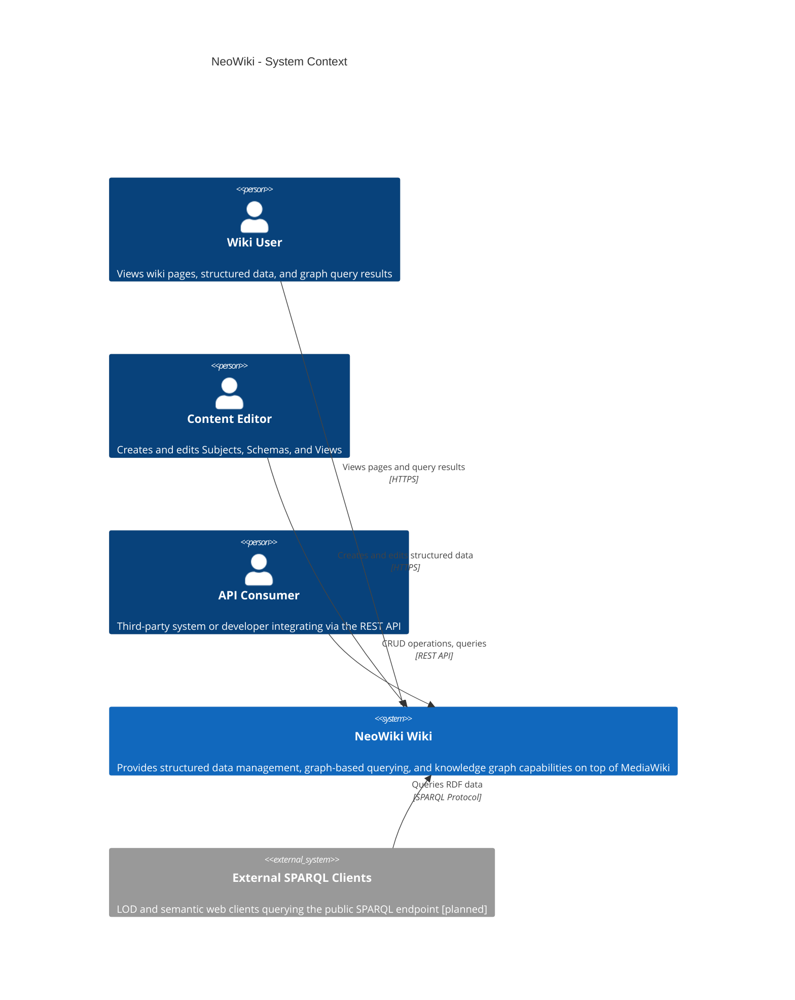
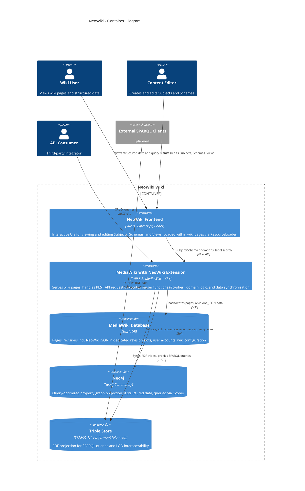

# Architecture Overview

These diagrams follow the [C4 model](https://c4model.com/) and render natively on GitHub via Mermaid.

## System Context

NeoWiki and its users and external systems.

## Containers

The major technical building blocks inside the NeoWiki Wiki system.

