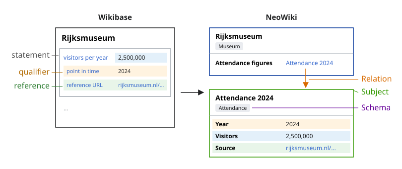

# Qualifiers and References

NeoWiki Statements have no qualifiers, references, or rank, unlike Wikibase Statements. A Statement is flat: one
property and its Value, with no inner structure. You express qualified and referenced data by reifying it — the value
that needs context becomes its own Subject with its own Schema, linked from the main Subject by a Relation. A page can
hold any number of Subjects ([ADR 7](adr/007-multiple-subjects-per-page.md)), so this adds Subjects, not a page per
value.



NeoWiki is a [Property Graph](https://en.wikipedia.org/wiki/Property_graph): Subjects are nodes with typed properties
and Relations are edges.

For the underlying concepts (Subject, Statement, Relation, Schema), see the [Glossary](glossary.md).

## Qualifying a value or a link: model it as its own Subject

Promoting a value into its own Subject is the same move as a Semantic MediaWiki subobject, except the intermediate node
has a Schema.

Take a museum's yearly attendance. Define an `Attendance` Schema and link one Attendance Subject per year:

```text
Museum Schema
  Attendance figures: relation → Attendance (multiple)

Attendance Schema
  Year:     number
  Visitors: number
  Source:   url
```

Each Attendance Subject (`{ Year: 2024, Visitors: 2500000, Source: "https://…" }`) holds what Wikibase would put as a
qualifier (`Year`) and a reference (`Source`) on one population Statement. Here they are typed properties governed by
the `Attendance` Schema, so they validate and render like any other data. A linked Subject can link to further
Subjects, with no depth limit. Qualify a link the same way: retarget the Relation at a new Subject that holds the
qualifying properties and carries its own Relation to the original target.

The Attendance Subjects can live on their own pages or as additional [Subjects](glossary.md#page) on the museum's
page. The [Subject Format](api/subject-format.md#complete-example) shows the same pattern in JSON.

## References

A reference is provenance, modelled as an ordinary property: add a `Source` (or similar) property to the linked
Subject's Schema.

## Rank

NeoWiki has no rank. What rank encodes is ordinary data: model it explicitly — typically a date property for current
vs. historical values, or a status property for deprecated ones.

## Mapping from Wikibase

| Wikibase | NeoWiki |
|---|---|
| Statement | A Subject's Statement (property + value), or a Relation |
| Qualifier | A property on a linked Subject (reify the value or the link) |
| Reference | An ordinary property (e.g. `Source`) on the linked Subject |
| Rank | No equivalent; model explicitly (dated Subjects, status properties) |
| Statement ID | Statements have none; Subjects and Relations both have stable IDs |
| `novalue` / `somevalue` | No equivalent |

## In RDF

A qualified value round-trips without loss: a linked Subject is its own resource, and a Relation keeps its ID
([Graph Model](api/graph-model.md)). See [RDF Export](api/rdf-export.md) for the native projection and
[Mapping Format](authoring/mapping-format.md) for projecting into standard ontologies such as EDM.

## Presentation

How a property renders is set by Display Attributes and [Layouts](glossary.md#layout), not by fields on the Statement.

## Further reading

- [Glossary](glossary.md) — Subject, Statement, Relation, Schema, Layout
- [Subject Format](api/subject-format.md) and [Graph Model](api/graph-model.md)
- [Project a Person to EDM](guide/person-to-edm.md) — ontology mapping end to end; its CIDOC-CRM tier
  revisits intermediate-node modelling at the RDF level
